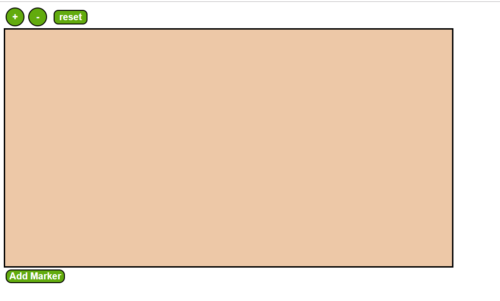

# Map Mock UI

React based component showing a Mock Map UI with adding Marker and Zooming Functionality

## Usage

Follow these steps to Get Started:

 - Clone the Repository ( if you don't have the zip )
 `git clone https://github.com/evilc0des/map-mock-ui.git`
 
 - Install Dependency
    `npm install`
    
 - Start the App
	`npm start`
	Runs the app in the development mode with hot-reloading and linting.  
	Open  [http://localhost:3000](http://localhost:3000/)  to view it in the browser.

### Other Available Commands

#### `npm test`

Launches the test runner in the interactive watch mode.  
See the section about  [running tests](https://facebook.github.io/create-react-app/docs/running-tests)  for more information.

#### `npm run build`

Builds the app for production to the  `build`  folder.  
It correctly bundles React in production mode and optimizes the build for the best performance.

The build is minified and the filenames include the hashes.  
Your app is ready to be deployed!

## Component API

The component can be used as follows.

 - Import the component
 `import Map from  "./Map";`
 
 - Use the Component in your Render method
  `<Map/>`

The Component optionally takes the props **maxZoom** and **zoomStep**
`<CropComponent maxZoom={5} zoomStep={0.2}/>`

**maxZoom** expects a number which denotes the maximum amount of zoom to be allowed. The number is the multiplier. i.e. 2 denotes 2x the normal zoom.
*(Defaults to 5)*

**zoomStep** expects a number which denotes the increment and decrement steps of the zoom which affects how fast you can zoom in or out.
*(Defaults to 0.2)*

## Additional Notes

 - The component is built totally with React. Redux is not used as a State Store would be an overkill for a small app as this with only three levels of nesting and one Container Component. There are no other dependency, zoom and all other required functionality is implemented manually. 
 
 - For styling, i have used CSS in JS and use JSS for implementing it. Although small projects as such don't have issues that arise from Sass/LESS or traditional CSS in big projects at scale like Global Namespaces and Non deterministic resolution of specifity, CSS in JS is still a good practise in my opinion to establish isolation in our code and to establish true essence of Component based Architecture.
 
## Implementation Walkthrough
This section provides Screenshots and walkthrough of the features and functionalities - 
 
